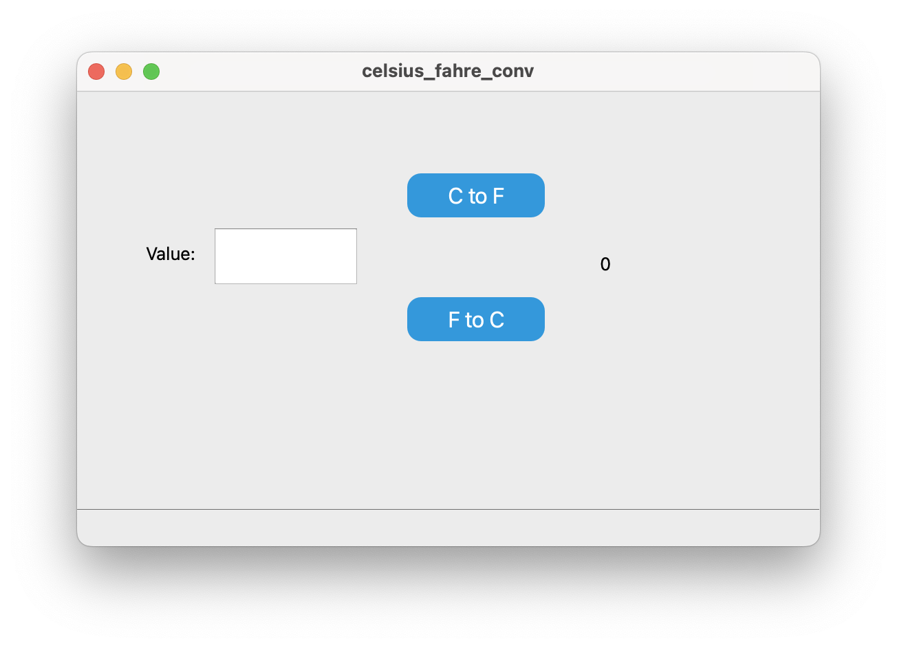

# 🌡️ Celsius ↔ Fahrenheit Converter (Qt)

A simple temperature converter application built using **Qt Framework (C++)**.  
It allows users to easily convert temperature values between **Celsius** and **Fahrenheit**.

---

## 🚀 Features
- Convert **Celsius → Fahrenheit**  
- Convert **Fahrenheit → Celsius**  
- Simple and user-friendly interface (designed with Qt Designer)  
- Real-time conversion result display  

---

## 🧠 Technologies Used
- **Qt 6 / Qt Creator**  
- **C++**  
- **Qt Widgets** (QMainWindow, QPushButton, QTextEdit, QLabel)

---

## 🖥️ Screenshot *(optional)*  
> 

---

## ⚙️ How to Run
1. Open the project in **Qt Creator**.  
2. Select `File → Open File or Project` and choose the `.pro` file.  
3. Build and run the project.  

---

## 💡 Usage
1. Enter the temperature value in the input field.  
2. Click one of the buttons:
   - **C → F** : Converts Celsius to Fahrenheit  
   - **F → C** : Converts Fahrenheit to Celsius  
3. The result will be displayed in the result label.

---

